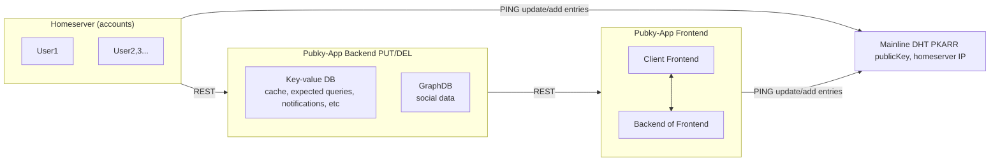

# Pubky Homeserver

## Overview

Pubky Homeserver is a core component of the Pubky ecosystem, built to manage decentralized data storage and identity operations. Unlike the Pubky App, which focuses on user-facing features, the homeserver's primary role is data synchronization, decentralized identity management (via PKARR), and ensuring user autonomy in a censorship-resistant way.

## Features

- **Decentralized Data Storage**: Store and synchronize user data in a fully decentralized manner.
- **Data Availability**: Ensure consistent data availability across all devices connected to the homeserver.
- **PKARR Management**: Manage Public Key Addressable Resource Records for decentralized identities.
- **Integration with Pubky Core**: Seamlessly interact with the Pubky network for data and identity management.

## Architecture Diagram
Below is a high-level architecture diagram of the Pubky Homeserver, showing its integration with Pubky Core, PKARR, and end-user devices:


The diagram illustrates how the homeserver communicates with user devices and the Pubky Core, ensuring consistent and decentralized data management.

## Technology Stack

- **Backend**: Built using Pubky Core for decentralized data management.
- **Homeserver**: Stores and synchronizes user data, ensuring resilience and censorship resistance.
- **PKARR Integration**: Supports decentralized identity management and addressing.

## Prerequisites

- **Node.js**: Version 14.x or higher.
- **npm**: Version 6.x or higher.
- **Pubky SDK**: Required for interaction with the Pubky Core protocol.

Ensure these prerequisites are installed before proceeding with setup.

## Installation

First, copy the environment file:

```sh
$ cp example.env .env
```


Update the `.env` file with the following required variables:

- `PUBKY_API_KEY`: The API key for Pubky Core. This key is necessary for authenticating requests and integrating with Pubky Core services.
- `HOMESERVER_URL`: URL for the homeserver that stores and synchronizes user data. This homeserver is responsible for keeping user content available and synchronized across devices.
- `PKARR_ENDPOINT`: Endpoint URL for PKARR services, which are essential for managing user identities and addressing content in a decentralized manner.

Install dependencies:

```sh
$ npm install
```

Start the development server:

```sh
$ npm run dev
```

## Deployment

To deploy the application:

Copy the environment file:

```sh
$ cp example.env .env
```

Install dependencies, build, and preview the project:

```sh
$ npm install
$ npm run build
$ npm run preview
```

## Usage

Pubky Homeserver can be used for:

- **Decentralized Data Synchronization**: Store and synchronize user-generated content and metadata across devices without relying on central servers.
- **Identity Management**: Manage decentralized identities and Public Key Addressable Resource Records (PKARR).
- **Censorship Resistance**: Enable data storage and sharing in a censorship-resistant manner, ensuring user autonomy.

## Contribution

We welcome contributions from the community. If you're interested in contributing, please fork the repository, create a branch, and submit a pull request.

## License

This project is licensed under the MIT License. See the LICENSE file for more information.

## Community and Support

Join our community to stay up-to-date with the latest news and developments:

- [Twitter X Updates](https://x.com/getpubky)
