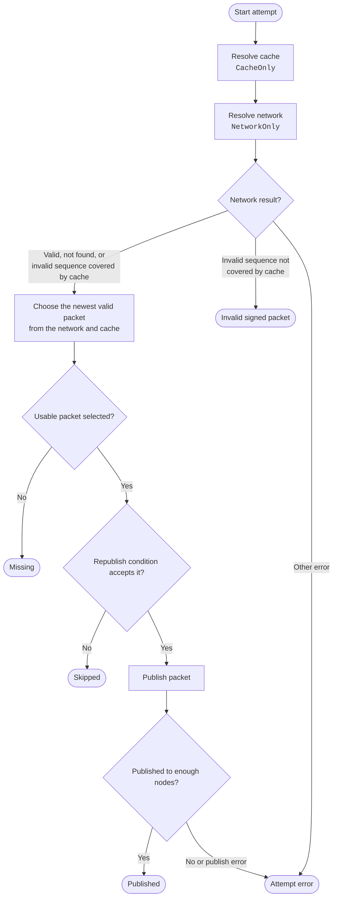
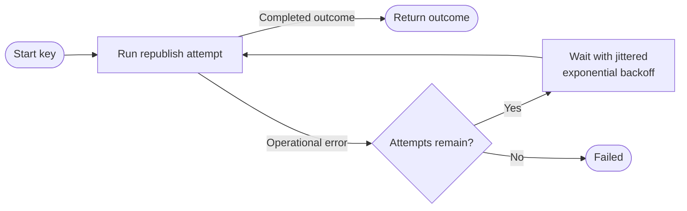

# Homeserver PKARR Republishing

The homeserver republishes a PKARR packet by resolving the cache and network,
selecting the newest usable packet, and publishing it to a sufficient number of
nodes. `RetryingRepublisher` repeats the entire attempt when an operational
error occurs.

Cached packets are currently used only for comparison and fallback. Publishing
directly from the cache is disabled because a successful publish cannot reveal
whether a minority of queried nodes holds a newer packet. See
[mainline#113](https://github.com/pubky/mainline/issues/113).

The user-key republisher accepts a packet only when its `_pubky` HTTPS or SVCB
target is this homeserver's public key. Users whose records point elsewhere are
reported as skipped; their stored data is not removed.

## Single Attempt

Cache lookup failures are treated as cache misses, so they do not prevent a
network lookup. The cache is queried only once per attempt, and that snapshot
is reused when selecting the packet.

## Retry Wrapper

Only operational errors are retried. Completed outcomes return immediately,
including outcomes where nothing was published.

## Outcomes

| Outcome | Meaning |
| --- | --- |
| `Published` | The selected packet was accepted by at least the configured minimum number of nodes. |
| `Skipped` | A packet was found, but the configured republish condition rejected it. |
| `Missing` | Neither the network nor the cache contained a usable packet. |
| `InvalidSignedPacket` | Network resolution returned `InvalidSignedPacket` for a sequence not covered by the cached packet. |
| `Failed` | All attempts ended in an operational resolution or publication error. |

An invalid network result still carries the DHT item's sequence number. The
cached packet covers that result when its timestamp is equal to or newer than
the sequence. In that case, the cached packet remains eligible for selection.
