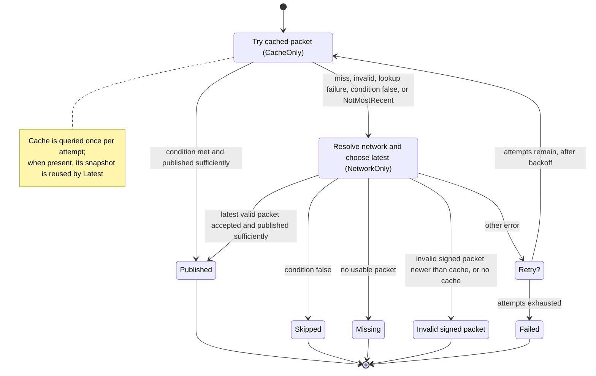

# Homeserver PKARR Republishing

This covers one `Republisher::republish` attempt together with the retry loop in
`RetryingRepublisher`.

"Invalid signed packet" means the DHT mutable item is valid, but its payload is
not a valid Pkarr signed packet. An equal or older invalid sequence is covered
by the cached packet and continues through `Latest`.

Known limitation: a cached publish can report success while a newer packet
exists on a minority of queried nodes. See
[mainline#113](https://github.com/pubky/mainline/issues/113).
