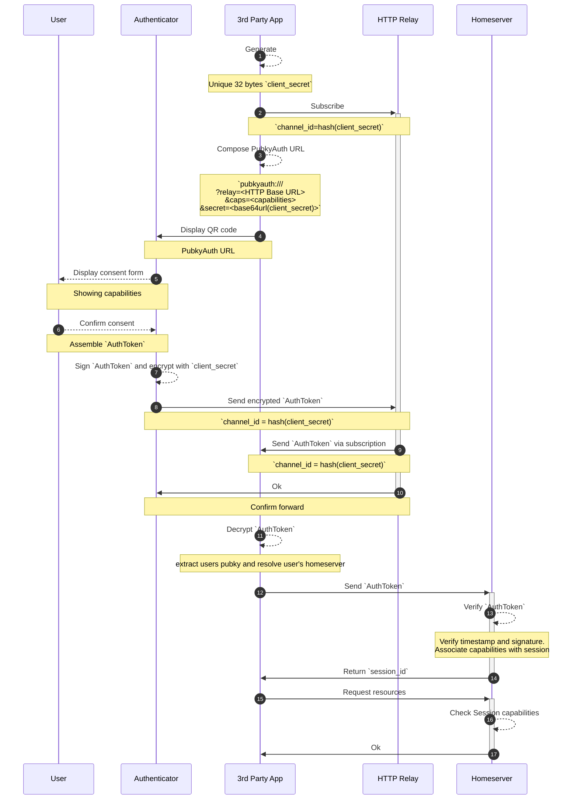

# Pubky Auth

Pubky Auth is a protocol for using a user's [root key](../concepts/rootkey.md) to authenticate themselves to a 3rd party app and to authorize that app to access resources on the user's [Homeserver](../concepts/homeserver.md).

### Glossary
1. **User**: an entity owner of secret and public key and owner of assets which can be accessed on location identified by their public key.
2. **Authenticator**: an application holding the Keypair used in authentication. Eg [Pubky Ring](https://github.com/pubky/pubky-ring).
3. **Issuer**: an entity that issues access on behalf of **Pubky** to **3rd Party App**.
4. **Pubky**: the public key (pubky) identifying the user secret key to which is owned by user.
6. **3rd Party App**: an application trying to get authorized to access some resources belonging to the **Pubky**.
5. **Homeserver**: the public key (pubky) identified storage of resources the belong to **Pubky**.
7. **Capabilities**: a list of strings specifying scopes and the actions that can be performed on them.
8. **HTTP relay**: an independent HTTP relay (or the backend of the 3rd Party App) used for communication between **3rd Party App** and **Authenticator** . Since neither **Authenticator** nor **3rd Party App** are extrernally reachable.

## Flow


1. `3rd Party App` generates a unique (32 bytes) `client_secret`.
2. `3rd Party App` uses the `base64url(hash(client_secret))` as a `channel_id` and subscribe to that channel on the `HTTP Relay` it is using.
3. `3rd Party App` formats a Pubky Auth url:
```
pubkyauth:///
   ?relay=<HTTP Relay base (without channel_id)>
   &caps=<required capabilities>
   &secret=<base64url(client_secret)>
```
 for example 
 ```
pubkyauth:///
  ?relay=https://demo.httprelay.io/link
  &caps=/pub/pubky.app/:rw,/pub/example.com/nested:rw
  &secret=mAa8kGmlrynGzQLteDVW6-WeUGnfvHTpEmbNerbWfPI
 ```
 and finally show that URL as a QR code to the user.
4. The `Authenticator` app scans that QR code, parse the URL, and show a consent form for the user.
5. The user decides whether or not to grant these capabilities to the `3rd Party App`.
7. If the user approves, the `Authenticator` then uses their Keypair, to sign an [AuthToken](#authtoken), and encrypt it with the `client_secret`, then calculate the `channel_id` by hashing `client_secret`, and send encrypted token to the callback url(`relay` + `channel_id`).
8. `HTTP Relay` forwards the encrypted AuthToken to the `3rd Party App` frontend.
9. `HTTP Relay` confirms the delivery with the `Authenticator`
10. `3rd Party App` decrypts the AuthToken using its `client_secret`, read the `pubky` in it, and send it to their `homeserver` to obtain a session.
11. `Homeserver` verifies the session and stores the corresponding `capabilities`.
12. `Homeserver` returns a session id to the frontend to use in subsequent requests.
13. `3rd Party App` uses the session id to access some resource at the Homeserver.
14. `Homeserver` checks the session capabilities to see if it is allowed to access that resource.
15. `Homeserver` responds to the `3rd Party App` with the resource.

## AuthToken encoding
```abnf
AuthToken   = signature namespace version timestamp pubky capabilities

signature      = 64OCTET ; ed25519 signature over the rest of the token
namespace      = %x50.55.42.4b.59.3a.41.55.54.48 ; "PUBKY:AUTH" in UTF-8 (10 bytes)
version        = 1*OCTET ; Version of the AuthToken for future proofing
timestamp      = 8OCTET ; Big-endian UNIX timestamp in microseconds
pubky          = 32OCTET ; ed25519 public key of the user
capabilities   = *(capability *( "," capability ))

capability     = scope ":" actions ; Formatted as `/path/to/resource:rw`

scope          = absolute-path ; Absolute path, see RFC 3986
absolute-path  = 1*( "/" segment )
segment        = <segment, see [URI], Section 3.3>

actions      = 1*action
action        = "r" / "w" ; Read or write (more actions can be specified later)
```

### AuthToken verification
To verify a token the `Homeserver` should:
1. Check the 75th byte (version) and make sure it is `0` for this spec.
2. Deserialize the token
3. Verify that the `timestamp` is within a window from the local time: the default should be 45 seconds in the past and 45 seconds in the future to handle latency and drifts.
4. Verify that the `pubky` is the signer of the `signature` over the rest of the serialized token after the signature (`serialized_token[65..]`).
5. To avoid reuse of the token the `Homeserver` should consider the `timestamp` and `pubky`  (`serialized_token[75..115]`) as a unique sortable ID, and store it in a sortable key value store, rejecting any token that has the same ID, and removing all IDs that start with a timestamp that is older than the window mentioned in step 3.

## Unhosted Apps and Relays
Callback URLs work fine for full-stack applications. There are however many cases where you would want to develop an application without a backend, yet you still would like to let users sign in and bring their own backend. The idea of [Unhosted](https://unhosted.org/) applications is one of the main reasons we are developing Homeservers.

These applications will still need some [relay](https://httprelay.io/) to receive the `AuthToken` when the `Authenticator` sends it to the callback URL. Since the `AuthToken` is a bearer token these relays can intercept it and use it before the unhosted app. That is why we need to encrypt the `AuthToken` with a key that the relay doesn't have access to, and only shared between the app and the `Authenticator` 

## Limitations of `v0`

### No delegation
In version zero, the `pubky`/`User` IS the `issuer`, meaning that the `AuthToken` is signed by the same key of the `pubky`. This is to simplify the spec, until we have a reason to keep the `issuer` keys even more secure than being in a mobile app used rarely to authenticate a browser session once in a while.

Having an `issuer` that isn't exactly the `pubky` means the `issuer` themselves need a certificate of delegation signed by the `pubky`. This can be done in following ways:
-  Lookup that certificate on the Homeserver. Which may make the verification process possibly taking too long to timeout
- Send the certificates chain with the token. Which brings on the problem of revocation..

### Expiration is out of scope
While the token itself can only be used for very brief period, it is immediately exchanged for another authentication mechanism (usually a session ID). Deciding the expiration date of that authentication, if any, is out of the scope of this spec.

The assumption here is that we are authorizing a session to the `Homeserver` such that the user can always access all active sessions and revoke any session that they don't like, all from the `Authenticator` app.

Other services are free to choose their authentication system once the homeserver verifies the pubky auth token, whether that is a JWT or a Session with or without expiration and are free to allow the user to manage sessions the way they see fit.
